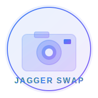

# JAGGER SWAP

<p align="center">
  
</p>

<p align="center">
  <strong>Real-Time Portrait Animation System</strong>
</p>

<p align="center">
  <a href="#features">Features</a> •
  <a href="#tech-stack">Tech Stack</a> •
  <a href="#getting-started">Getting Started</a> •
  <a href="#project-structure">Project Structure</a> •
  <a href="#development">Development</a> •
  <a href="#deployment">Deployment</a> •
  <a href="#roadmap">Roadmap</a>
</p>

---

## 🎯 Overview

JAGGER SWAP is a real-time portrait animation system that allows users to upload a portrait and animate it using their webcam. The system tracks body movements and facial expressions to create realistic animations while preserving the original identity, hair, clothing, and accessories.

### Current Status: Milestone 1 Complete ✅

This is the foundation for the full JAGGER SWAP application. Milestone 1 includes the complete website and backend infrastructure. The AI animation engine will be implemented in future milestones.

## ✨ Features

- **Modern Landing Page**: Beautiful, responsive dark-themed UI
- **Webcam Integration**: Live camera preview with permission handling
- **Image Upload**: Support for PNG, JPEG, JPG with validation
- **Two-Panel Layout**: Side-by-side webcam and animated portrait view
- **Control Panel**: Camera controls, upload management, settings
- **RESTful API**: Clean, documented FastAPI backend
- **Docker Support**: Containerized frontend and backend
- **CI/CD Pipeline**: GitHub Actions for automated testing

## 🚀 Tech Stack

### Frontend
- **Next.js 14** - React framework with App Router
- **React 18** - UI library
- **TypeScript** - Type-safe development
- **Tailwind CSS** - Utility-first styling
- **Lucide React** - Icon library

### Backend
- **FastAPI** - Modern Python web framework
- **Python 3.11** - Runtime
- **Pydantic** - Data validation
- **Uvicorn** - ASGI server

### DevOps
- **Docker & Docker Compose** - Containerization
- **GitHub Actions** - CI/CD automation
- **Vercel** - Frontend deployment (configured)
- **GPU Infrastructure** - Backend deployment ready

## 📋 Milestones

| Milestone | Description | Status |
|-----------|-------------|--------|
| Milestone 1 | Foundation - Website & Backend | ✅ Complete |
| Milestone 2 | AI Animation Engine | 🔜 In Progress |
| Milestone 3 | Advanced Features & Optimization | 📋 Planned |

## 🏃 Getting Started

### Prerequisites

- Node.js 20+
- Python 3.11+
- Docker & Docker Compose (optional)

### Quick Start

#### Using Docker Compose (Recommended)

```bash
# Clone the repository
git clone https://github.com/your-org/jagger-swap.git
cd jagger-swap

# Start all services
docker-compose up

# Access the application
# Frontend: http://localhost:3000
# Backend: http://localhost:8000
# API Docs: http://localhost:8000/docs
```

#### Manual Setup

**Frontend:**

```bash
cd frontend
npm install
npm run dev
```

**Backend:**

```bash
cd backend
python -m venv venv
source venv/bin/activate  # On Windows: venv\Scripts\activate
pip install -r requirements.txt
uvicorn app.main:app --reload
```

## 📁 Project Structure

```
jagger-swap/
├── frontend/                    # Next.js Frontend
│   ├── src/
│   │   ├── app/                # App router pages
│   │   │   ├── layout.tsx      # Root layout
│   │   │   └── page.tsx        # Landing page
│   │   ├── components/         # React components
│   │   │   ├── ui/             # UI primitives
│   │   │   ├── Header.tsx      # Site header
│   │   │   ├── Hero.tsx        # Hero section
│   │   │   ├── WebcamPanel.tsx # Webcam display
│   │   │   ├── AnimatedPortrait.tsx
│   │   │   ├── ControlPanel.tsx
│   │   │   └── SessionView.tsx
│   │   ├── hooks/              # Custom hooks
│   │   │   ├── useWebcam.ts    # Webcam management
│   │   │   └── useImageUpload.ts
│   │   ├── lib/                # Utilities
│   │   │   └── api.ts          # API client
│   │   ├── styles/             # Global styles
│   │   └── types/              # TypeScript types
│   ├── public/                 # Static assets
│   ├── package.json
│   ├── tailwind.config.ts
│   └── Dockerfile
│
├── backend/                     # FastAPI Backend
│   ├── app/
│   │   ├── main.py            # FastAPI app
│   │   ├── api/
│   │   │   └── endpoints/     # API routes
│   │   │       ├── upload.py
│   │   │       ├── camera.py
│   │   │       ├── animation.py
│   │   │       └── status.py
│   │   ├── core/
│   │   │   └── config.py      # Settings
│   │   ├── schemas/           # Pydantic models
│   │   └── services/          # Business logic
│   ├── tests/                 # Unit tests
│   ├── requirements.txt
│   └── Dockerfile
│
├── .github/
│   └── workflows/             # CI/CD pipelines
│       ├── ci.yml
│       ├── frontend-ci.yml
│       └── backend-ci.yml
│
├── configs/                    # Configuration files
├── docs/                       # Documentation
├── scripts/                    # Utility scripts
├── docker-compose.yml          # Development compose
├── docker-compose.prod.yml    # Production compose
└── README.md
```

## 🔧 Development

### Code Quality

```bash
# Frontend linting
npm run lint

# Frontend formatting
npm run format

# TypeScript type checking
npm run type-check

# Backend formatting (Black)
black app/

# Backend linting (Flake8)
flake8 app/
```

### Testing

```bash
# Frontend tests
npm test

# Backend tests
pytest
```

### Environment Variables

**Frontend (.env):**
```
NEXT_PUBLIC_API_URL=http://localhost:8000
```

**Backend (.env):**
```
APP_NAME=JAGGER SWAP
APP_VERSION=1.0.0
DEBUG=false
MAX_FILE_SIZE=10485760
UPLOAD_DIR=./uploads
```

## 🚢 Deployment

### Frontend (Vercel)

1. Connect your GitHub repository to Vercel
2. Set environment variable: `NEXT_PUBLIC_API_URL`
3. Deploy automatically on push to main

### Backend (GPU Infrastructure)

For future GPU-accelerated deployment:

```bash
# Build with GPU support
docker-compose -f docker-compose.prod.yml build

# Deploy with GPU
docker-compose -f docker-compose.prod.yml up -d
```

## 📡 API Reference

### Upload Endpoints

| Method | Endpoint | Description |
|--------|----------|-------------|
| POST | `/upload/` | Upload image file |
| GET | `/upload/{file_id}` | Get file info |
| DELETE | `/upload/{file_id}` | Delete file |

### Camera Endpoints

| Method | Endpoint | Description |
|--------|----------|-------------|
| POST | `/camera/start` | Start camera |
| POST | `/camera/stop` | Stop camera |
| GET | `/camera/devices` | List cameras |
| GET | `/camera/status` | Camera status |

### Animation Endpoints

| Method | Endpoint | Description |
|--------|----------|-------------|
| POST | `/animation/start` | Start animation |
| GET | `/animation/status` | Animation status |
| POST | `/animation/stop` | Stop animation |

### Status Endpoints

| Method | Endpoint | Description |
|--------|----------|-------------|
| GET | `/status/` | API status |
| GET | `/status/health` | Health check |
| GET | `/status/info` | API info |

Full documentation at `/docs` when backend is running.

## 🛣️ Roadmap

### Milestone 1 ✅ (Complete)
- [x] Project structure setup
- [x] Next.js frontend with landing page
- [x] FastAPI backend with placeholder endpoints
- [x] Webcam integration
- [x] Image upload functionality
- [x] Two-panel layout
- [x] Docker support
- [x] GitHub Actions CI/CD

### Milestone 2 (In Progress)
- [ ] AI animation engine integration
- [ ] Body pose detection
- [ ] Facial landmark tracking
- [ ] Real-time animation processing
- [ ] GPU acceleration

### Milestone 3 (Planned)
- [ ] Advanced smoothing algorithms
- [ ] Multiple animation styles
- [ ] Batch processing
- [ ] Performance optimization
- [ ] Mobile app

## 🤝 Contributing

1. Fork the repository
2. Create your feature branch: `git checkout -b feature/amazing-feature`
3. Commit your changes: `git commit -m 'Add amazing feature'`
4. Push to the branch: `git push origin feature/amazing-feature`
5. Open a Pull Request

## 📄 License

This project is licensed under the MIT License - see the [LICENSE](LICENSE) file for details.

## 🙏 Acknowledgments

- Built with Next.js, FastAPI, and modern AI technologies
- Designed for scalability and future AI module integration
- Prepared for GPU-accelerated inference

---

<p align="center">
  <strong>JAGGER SWAP</strong> - Bringing Portraits to Life
</p>
